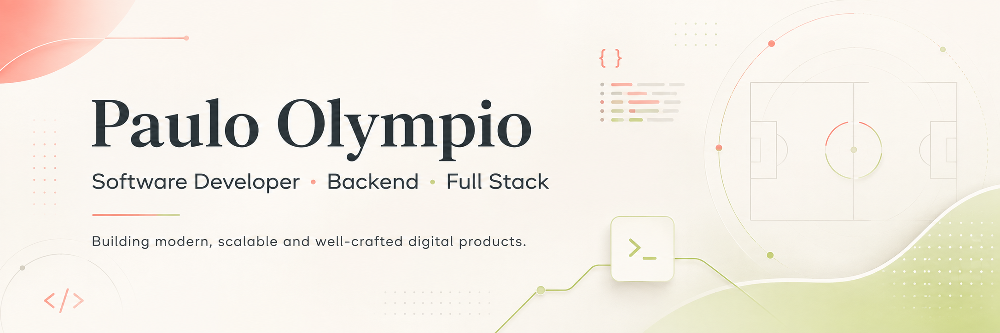

<p align="center">
  
</p>
# Paulo Olympio

### Software Developer · Backend · Full Stack

Desenvolvedor focado na construção de aplicações modernas, escaláveis e bem estruturadas, com atenção especial à **arquitetura, qualidade de código, experiência do usuário e evolução sustentável dos projetos**.

Atualmente desenvolvo projetos envolvendo **Java, Python e TypeScript**, explorando desde APIs e sistemas backend até aplicações web modernas e interfaces altamente personalizadas.

---

## Sobre mim

* 💻 Desenvolvedor de software com foco em aplicações web modernas
* ⚙️ Interesse especial em **Backend, APIs, arquitetura e sistemas escaláveis**
* 🎨 Também valorizo profundamente **UI/UX e identidade visual**
* ⚽ Desenvolvendo projetos relacionados a **futebol, dados e plataformas digitais**
* 🧠 Sempre buscando melhorar arquitetura, qualidade de código e boas práticas
* 🚀 Construindo projetos para evoluir constantemente como engenheiro de software

---

## Tech Stack

### Backend


### Frontend


### Database


### Tools


---

## Projetos em destaque

### ⚽ Football Platform

Plataforma voltada ao futebol com arquitetura preparada para integração com APIs, gerenciamento de dados, personalização por clube e futuras funcionalidades de análise.

`Python` · `FastAPI` · `PostgreSQL` · `React` · `TypeScript`

---

### 🎟️ Football Ticket System

Sistema moderno para venda e gerenciamento de ingressos de partidas de futebol, projetado com foco em arquitetura, organização e escalabilidade.

`Java` · `Spring Boot` · `PostgreSQL` · `TypeScript`

---

### 🛒 Fut Store

E-commerce temático de futebol desenvolvido com foco em experiência visual, organização do código e boas práticas de desenvolvimento web.

`TypeScript` · `React`

---

## GitHub

<div align="center">


</div>

---

## Atualmente explorando

```text
Arquitetura de Software
APIs REST
Java & Spring Boot
Python & FastAPI
React & Next.js
PostgreSQL
Sistemas orientados a dados
UI/UX para aplicações modernas
```

---

## Princípios que tento aplicar

```text
Clean Code
Modular Architecture
Separation of Concerns
Strong Typing
Maintainability
Scalability
Developer Experience
User Experience
```

---

## Contato

<div align="left">

[](https://github.com/pvolympio)

[](https://portfolio-paulo-olympio.vercel.app/pt)

[](www.linkedin.com/in/pauloolympio-desenvolvedor)

</div>

---

<div align="center">

### Building better software, one project at a time.

</div>
